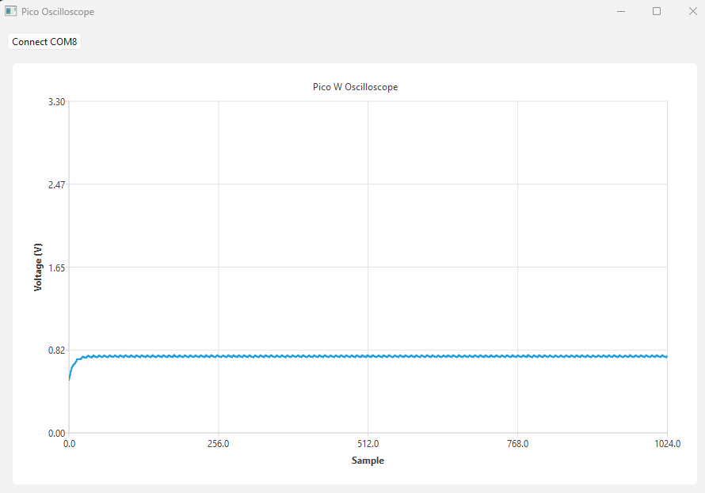

# Pico W Oscilloscope

A real-time oscilloscope built with a Raspberry Pi Pico W and a Qt6 desktop GUI, communicating over USB Serial.



## Features

- Real-time ADC sampling at 100kHz via DMA
- 1024 samples per frame with binary framing protocol
- Live waveform visualization in Qt6 GUI
- Custom start/end markers for reliable frame synchronization

## Architecture


## Tech Stack

### Firmware (C++)
- Raspberry Pi Pico SDK
- hardware_adc + hardware_dma
- USB CDC Serial (stdio)

### GUI (C++ / Qt6)
- Qt6 Widgets + QtCharts
- QSerialPort for USB communication
- CMake + Ninja build system

## Build

### Firmware
```bash
cd firmware/build
cmake .. -G "Ninja" -DPICO_BOARD=pico_w
ninja
# Flash pico_oscilloscope.uf2 to Pico W
```

### GUI
```bash
cd gui/build
cmake .. -G "Ninja" -DCMAKE_PREFIX_PATH="C:/Qt/6.11.1/mingw_64"
ninja
windeployqt oscilloscope_gui.exe
./oscilloscope_gui.exe
```

## Hardware

- Raspberry Pi Pico W
- USB cable
- Signal source connected to GP26 (Pin 31)

## License

MIT
